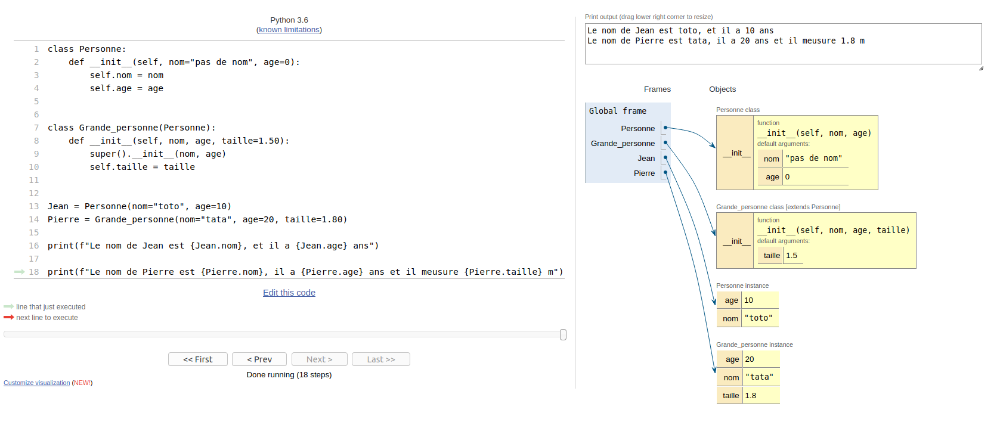

# Rapport programmation orientée objet en Python

### Barron Jean-Pascal M1 RIS Ynov Campus Bordeaux
https://github.com/ed0dy/POO_en_Python
## Intérêt de la POO

L’intérêt de la programmation orientée objet est que comme son nom l'indique on manipule des objets qui peuvent être par exemple une personne avec son nom, prénom et son age.
Une fois notre objet définit, il est construit avec une classe qui regroupe tous les attributs précédents (nom, age...).

En python tout est objet et tout est géré automatiquement, ce qui fait que quand on déclare un nombre par exemple on a pas besoin de lui indiquer son type (int, float...).




## Les difficultés rencontrées

La première difficulté était de rassembler tous les ingrédients disponibles dans mon inventaire

```python
def player(inv_0, inv_1, inv_2, inv_3, score):
    Liste_player = [inv_0, inv_1, inv_2, inv_3, score]
    print("Inventaire(4) + score : ", Liste_player, file=sys.stderr, flush=True)
```
J'ai ensuite du récupérer la liste des sorts que je pouvait faire

```python
def sorts(delta_0, delta_1, delta_2, delta_3):
    Liste_sorts = [delta_0, delta_1, delta_2, delta_3]
    print("Liste sorts : ", Liste_sorts, file=sys.stderr, flush=True)
```

## Les notions apprises et peaufinées

Notions apprises : Les classes, l’héritage et les fonctions variadiques

```python
# Les Classes et l'héritage

class Personne:
    def __init__(self, nom="pas de nom", age=0):
        self.nom = nom
        self.age = age


class Grande_personne(Personne):
    def __init__(self, nom, age, taille=1.50):
        super().__init__(nom, age)
        self.taille = taille


Jean = Personne(nom="toto", age=10)
Pierre = Grande_personne(nom="tata", age=20, taille=1.80)

print(f"Le nom de Jean est {Jean.nom}, et il a {Jean.age} ans")

print(
    f"Le nom de Pierre est {Pierre.nom}, il a {Pierre.age} ans et il meusure {Pierre.taille} m"
)
```

```python
# Les fonctions variadiques

args = ["Hello", " toto"]


def fonction_toto(h, t):
    return h + t


print(fonction_toto(*args))
```
Notions peaufinées : Les fonctions

```python
def fonction_0(nombre):
    nombre = 0
    return nombre


print(fonction_0(10))
```

## Retour d’expérience

Je suis globalement très satisfait de ce projet qui m'a permis de découvrir et d'approfondir plein de notions de Python. Je remercie beaucoup M.POULAILLEAU Vincent pour toutes ces explications et le temps qu'il à passé avec nous.